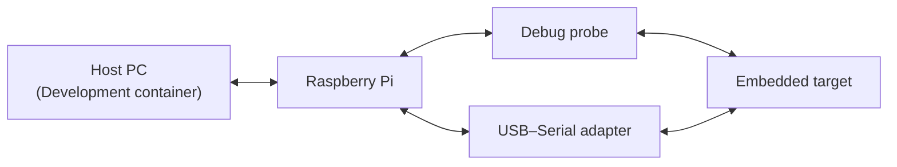

# Dual targeting setup

## Overview

The dual targeting setup defines an architecture that enables development and validation on host and embedded targets. It combines a containerized environment to accelerate all target-independent development, while interactions requiring access to the embedded target are routed through a Raspberry Pi acting as a hardware abstraction gateway.

The containerized development environment provides Software-in-the-Loop (SiL) capabilities with the following features:
- Ubuntu 24.04–based devcontainer. See [.devcontainer](../../.devcontainer/) folder.
- Preconfigured VS Code environment. See [.vscode](../../.vscode/) folder.

The Raspberry Pi runs a frozen, reproducible SD image and exposes standardized interfaces to the development container enabling repeatable target environments, Hardware-in-the-Loop (HiL) capabilities, and low-cost remote target access with the following features:
- Embedded target remote debugging via GDB server. See [embedded target remote debugging](../development_methodology/software_domain/resources/embedded_target_remote_debugging.md).
- Embedded target remote logging via serial-to-TCP bridge. See [embedded target remote logging](../development_methodology/software_domain/resources/embedded_target_remote_logging.md).
- Embedded target remote HiL testing via CTest. See [embedded target remote HiL testing](../development_methodology/software_domain/resources/embedded_target_remote_HiL_testing.md).

See [raspberry_pi_setup.md](raspberry_pi_setup.md) for Raspberry Pi setup and configuration.

The following diagram illustrates the expected hardware setup and communication architecture between the host environment and the embedded target.

## Glossary

| Term | Definition |
|------|------------|
| SiL (Software-in-the-Loop) | Execution of embedded software in a host environment without real embedded target hardware. |
| HiL (Hardware-in-the-Loop) | Execution of embedded software on real embedded target hardware integrated into an automated workflow. |
| Dual-target | Capability to execute hardware-independent code on both host and embedded targets. |

## Usage example

The [Embedded C Framework](../../sw/ecf/doc/ecf.md) provides a reference implementation using the dual targeting setup.
